# PhoenixCoder 业务流程文档

## 1. 业务流程概述

PhoenixCoder 是一个为程序员群体构建的**技能成长 + 项目实战 + 自我认证**三位一体的自由平台。平台通过任务大厅、技能成长、知识库、社区互动等核心功能，帮助程序员提升技能、获得项目经验并建立个人技术品牌。

### 1.1 核心业务价值
- **技能成长**：通过挑战任务和学习路径提升技术能力
- **项目实战**：参与真实项目获得实战经验
- **自我认证**：建立个人技能档案和技术声誉
- **社区互动**：与同行交流分享技术心得

### 1.2 平台架构
- **小程序端**：用户主要交互界面（任务大厅、成长中心、个人中心）
- **管理后台**：平台运营和内容管理
- **OIDC认证**：统一身份认证和授权
- **API服务**：核心业务逻辑处理

## 2. 用户角色定义

### 2.1 普通用户（程序员）
**角色描述**：平台的主要用户群体，包括在职程序员、自由职业者、学生等

**权限范围**：
- 浏览和接受任务
- 参与技能挑战
- 学习知识库内容
- 发布技术文章
- 管理个人资料和技能档案
- 参与社区讨论

**典型用户画像**：
- 初级程序员：寻求技能提升和项目经验
- 中级程序员：希望拓展技术栈和获得更好机会
- 高级程序员：分享经验、承接高价值项目

### 2.2 任务发布者
**角色描述**：有技术需求的个人或企业，发布项目任务

**权限范围**：
- 发布和管理任务
- 筛选和选择接单者
- 评价任务完成情况
- 查看接单者技能档案
- 支付任务报酬

**典型用户画像**：
- 创业公司：需要技术支持但预算有限
- 中小企业：临时性技术需求
- 个人开发者：需要特定技能协助

### 2.3 平台管理员
**角色描述**：负责平台运营、内容审核、用户管理的工作人员

**权限范围**：
- 用户管理（注册审核、权限管理、违规处理）
- 任务管理（审核、分类、推荐）
- 内容管理（知识库、文章审核）
- 数据分析（用户行为、平台运营指标）
- 系统配置（平台参数、业务规则）
- 财务管理（交易监控、费用结算）

## 3. 详细用户操作流程

### 3.1 用户注册登录流程

#### 3.1.1 微信小程序注册流程

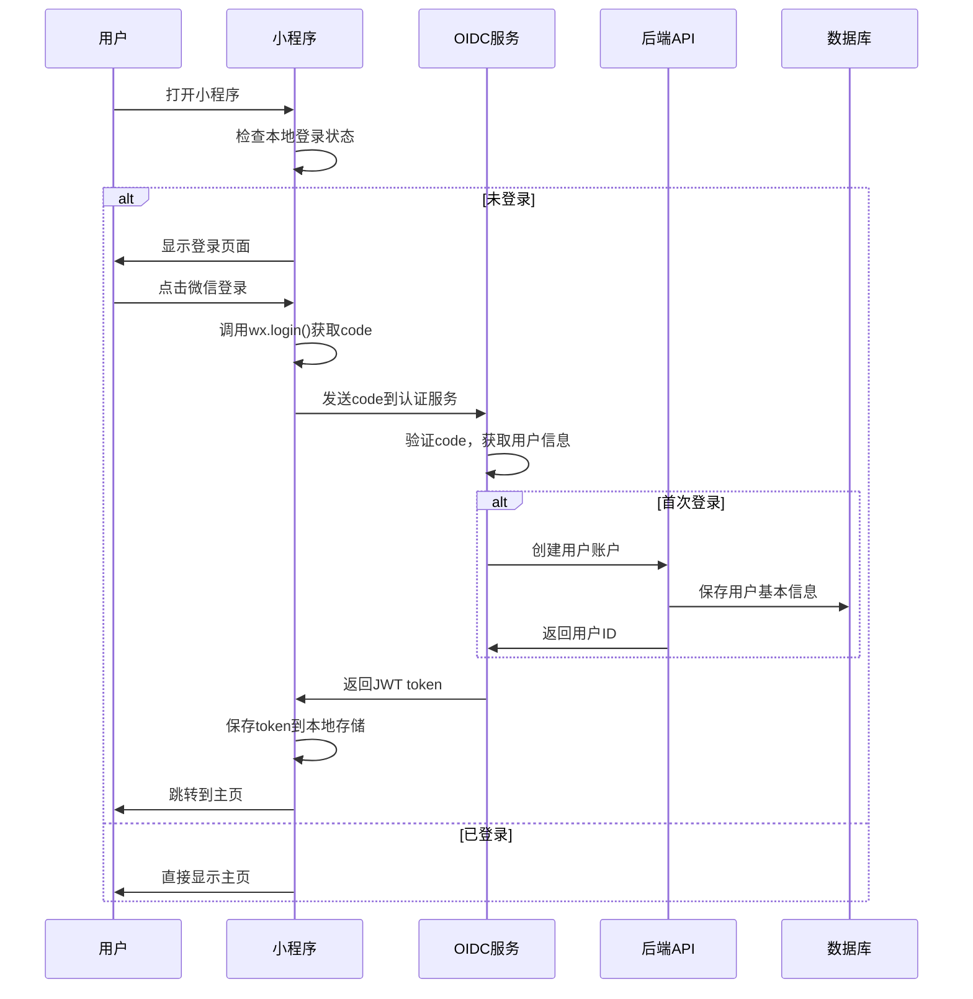

**详细步骤**：
1. **打开小程序**：用户通过微信扫码或搜索进入小程序
2. **登录检查**：小程序检查本地是否存在有效的登录token
3. **微信授权**：首次使用需要授权获取微信用户信息
4. **身份验证**：OIDC服务验证微信返回的code
5. **账户创建**：新用户自动创建账户，老用户直接登录
6. **Token发放**：返回JWT token用于后续API调用
7. **进入主页**：登录成功后进入任务大厅主页

**异常处理**：
- 网络异常：显示重试按钮，支持离线模式
- 授权失败：提示用户重新授权
- 服务器错误：显示友好错误信息

#### 3.1.2 管理后台登录流程

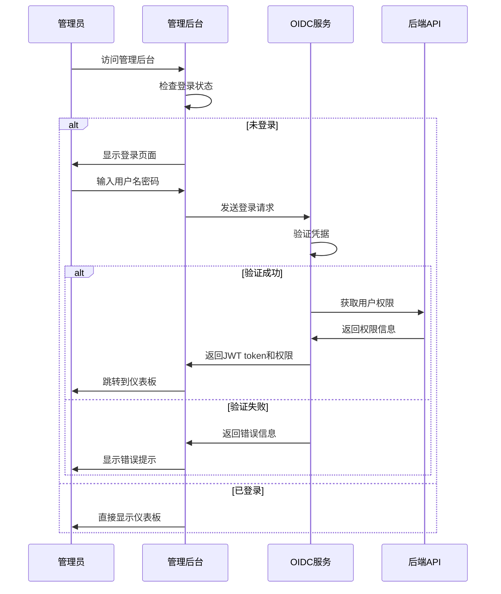

### 3.2 任务大厅浏览和接单流程

#### 3.2.1 任务浏览流程

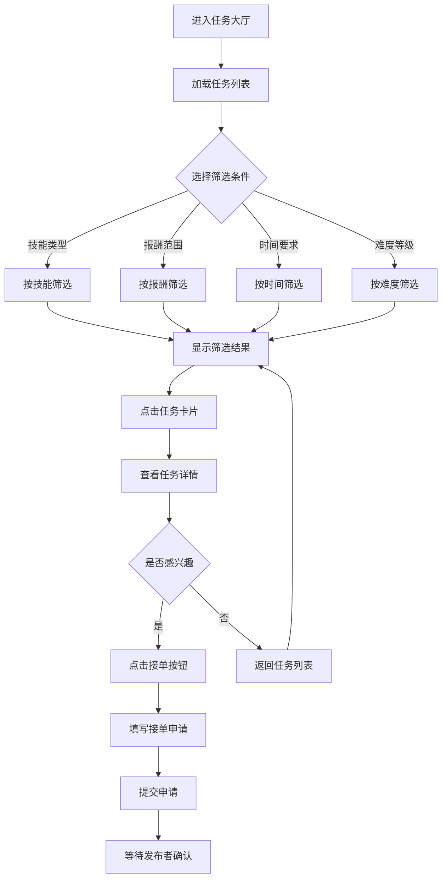

**详细步骤**：

1. **进入任务大厅**
   - 用户点击底部导航"任务大厅"标签
   - 系统加载推荐任务和最新任务
   - 显示任务分类标签（前端、后端、移动端、AI等）

2. **浏览任务列表**
   - 任务卡片显示：标题、技能要求、报酬、截止时间、难度等级
   - 支持上拉加载更多任务
   - 显示任务状态（招募中、进行中、已完成）

3. **筛选和搜索**
   - **技能筛选**：选择擅长的技术栈
   - **报酬筛选**：设置期望的报酬范围
   - **时间筛选**：根据可用时间选择任务
   - **难度筛选**：选择适合的难度等级
   - **关键词搜索**：输入关键词精确查找

4. **查看任务详情**
   - 任务描述和具体要求
   - 技能要求和经验要求
   - 报酬和支付方式
   - 项目周期和里程碑
   - 发布者信息和历史评价

#### 3.2.2 任务接单流程

**详细步骤**：

1. **提交接单申请**
   - 填写个人技能匹配度说明
   - 上传相关作品或项目经验
   - 提出项目实施方案
   - 确认项目周期和报酬

2. **等待发布者确认**
   - 系统发送通知给任务发布者
   - 发布者查看申请者资料
   - 发布者选择合适的接单者

3. **任务确认和开始**
   - 接单成功后签署电子合同
   - 建立项目沟通群组
   - 开始项目开发工作

**业务规则**：
- 用户只能同时接受3个进行中的任务
- 新用户需要完成技能认证才能接受高价值任务
- 任务发布者可以设置接单者的最低技能等级要求

### 3.3 技能成长和挑战流程

#### 3.3.1 技能评估流程

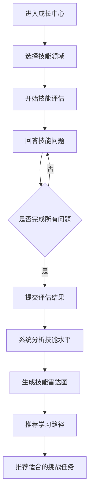

**详细步骤**：

1. **选择技能领域**
   - 前端开发（React、Vue、Angular等）
   - 后端开发（Java、Python、Node.js等）
   - 移动开发（iOS、Android、Flutter等）
   - 数据科学（Python、R、SQL等）
   - DevOps（Docker、K8s、CI/CD等）

2. **技能评估测试**
   - 理论知识选择题（30%）
   - 代码阅读理解题（40%）
   - 实际编程题（30%）
   - 根据答题情况动态调整题目难度

3. **生成技能档案**
   - 技能雷达图显示各维度能力
   - 技能等级（初级、中级、高级、专家）
   - 技能认证徽章
   - 技能成长轨迹

#### 3.3.2 挑战任务流程

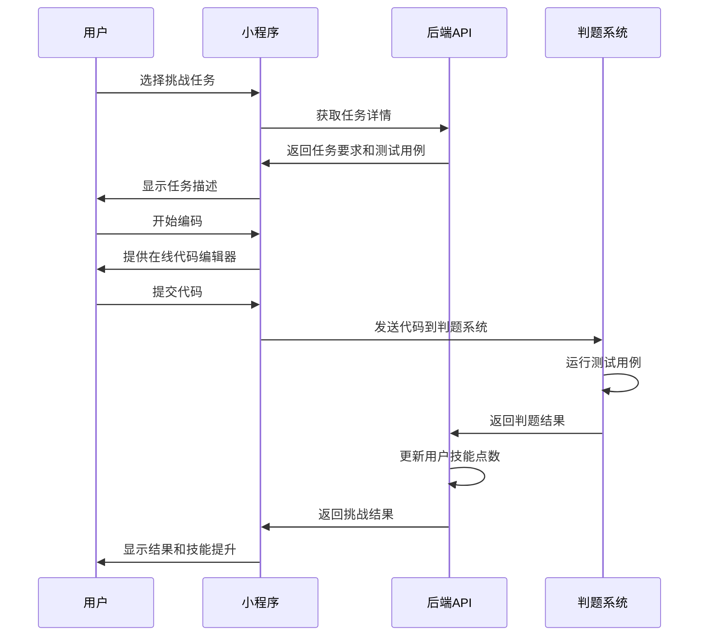

**挑战类型**：
- **算法挑战**：数据结构和算法题目
- **项目挑战**：完整功能模块开发
- **代码重构**：优化现有代码质量
- **系统设计**：架构设计和技术选型
- **调试挑战**：找出并修复代码bug

### 3.4 知识库学习流程

#### 3.4.1 学习路径选择

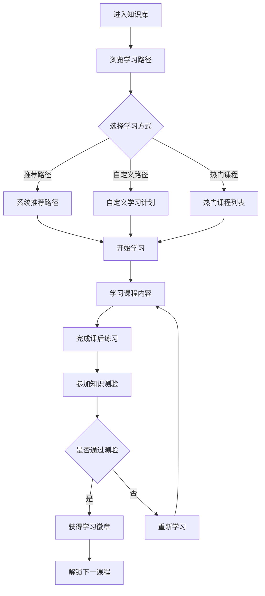

**学习内容类型**：
- **视频教程**：技术讲解和实战演示
- **图文教程**：详细的步骤说明和代码示例
- **交互式练习**：在线编程环境
- **项目实战**：完整项目开发指导
- **技术文档**：官方文档和最佳实践

#### 3.4.2 学习进度跟踪

**进度指标**：
- 学习时长统计
- 课程完成度
- 练习正确率
- 知识点掌握度
- 学习连续天数

**激励机制**：
- 学习徽章收集
- 技能点数奖励
- 学习排行榜
- 学习成就分享

### 3.5 个人资料和认证流程

#### 3.5.1 个人资料完善

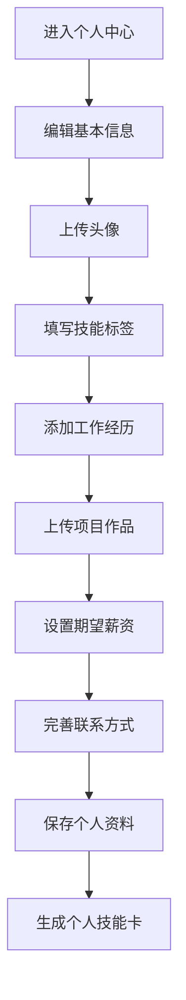

**资料内容**：
- **基本信息**：姓名、年龄、所在城市、教育背景
- **技能标签**：掌握的编程语言、框架、工具
- **工作经历**：公司、职位、工作时间、项目经验
- **项目作品**：GitHub链接、项目截图、技术说明
- **个人简介**：技术特长、职业规划、个人优势

#### 3.5.2 技能认证流程

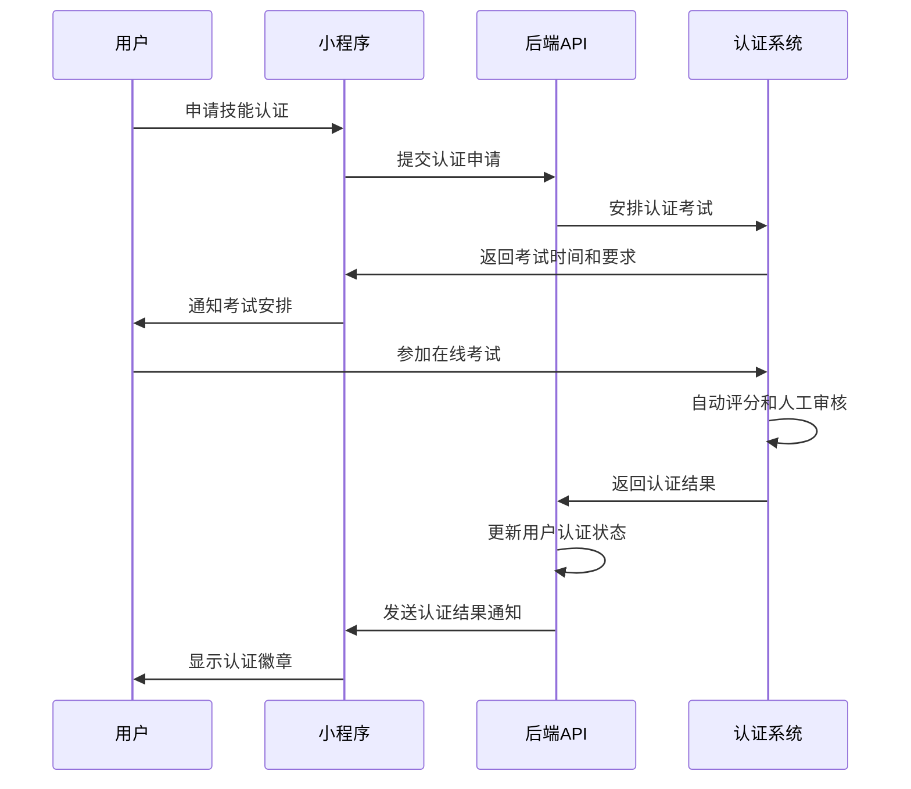

**认证类型**：
- **基础认证**：通过技能评估测试
- **项目认证**：提交完整项目作品
- **面试认证**：通过技术面试
- **企业认证**：企业内部技能认证

### 3.6 社区互动流程

#### 3.6.1 技术文章发布

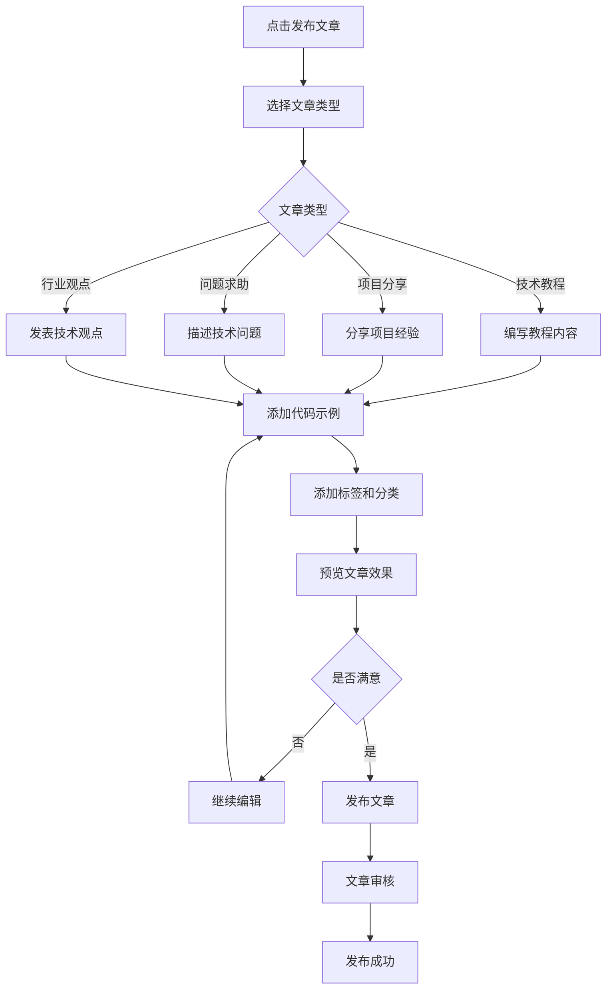

#### 3.6.2 社区互动功能

**互动方式**：
- **点赞和收藏**：对优质内容表示认可
- **评论和回复**：技术讨论和经验交流
- **关注和私信**：建立技术人脉
- **分享转发**：传播有价值的内容
- **举报和反馈**：维护社区环境

### 3.7 管理员后台管理流程

#### 3.7.1 用户管理流程

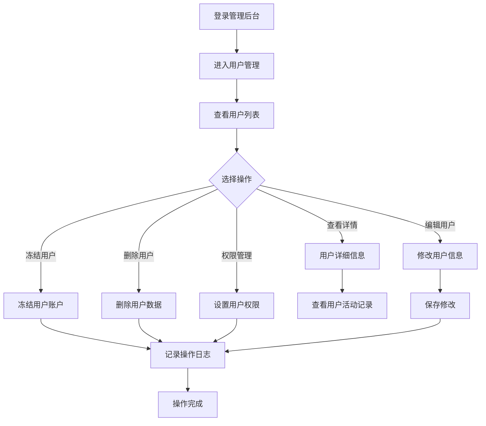

**管理功能**：
- **用户审核**：新用户注册审核
- **权限管理**：设置用户角色和权限
- **违规处理**：处理用户举报和违规行为
- **数据统计**：用户活跃度和行为分析

#### 3.7.2 任务管理流程

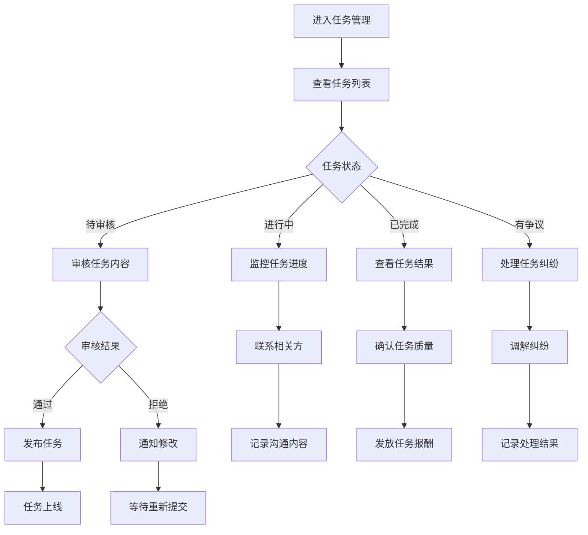

#### 3.7.3 内容管理流程

**管理范围**：
- **知识库内容**：课程、教程、文档的审核和分类
- **社区文章**：用户发布文章的审核和推荐
- **评论管理**：不当评论的删除和用户警告
- **标签管理**：技能标签和分类的维护

## 4. 流程图和时序图

### 4.1 整体业务流程图

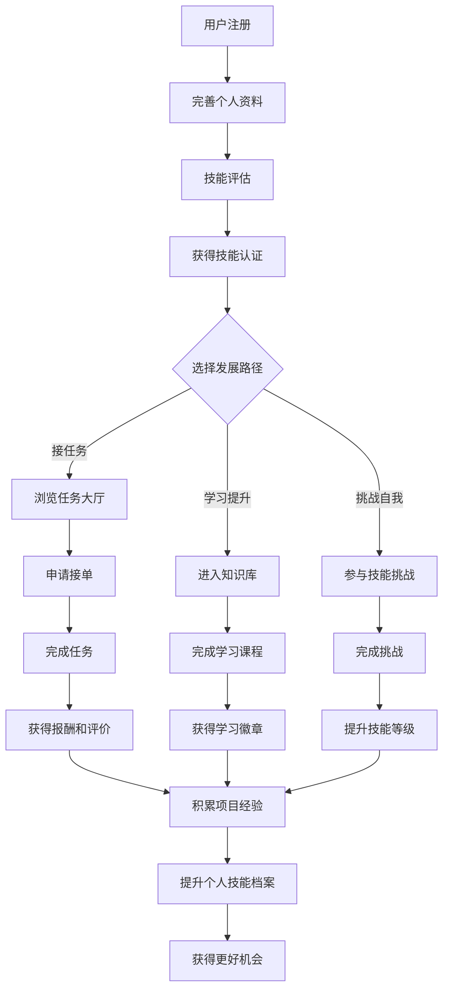

### 4.2 任务生命周期流程图

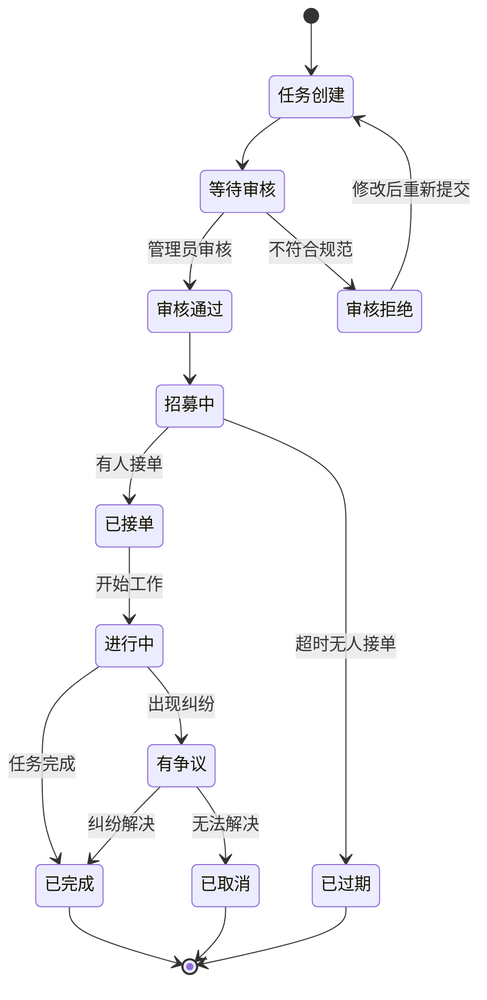

## 5. 异常处理和错误场景

### 5.1 用户操作异常

#### 5.1.1 登录异常
- **网络连接失败**：显示网络错误提示，提供重试按钮
- **微信授权失败**：引导用户重新授权或使用其他登录方式
- **账户被冻结**：显示冻结原因和申诉渠道
- **服务器维护**：显示维护通知和预计恢复时间

#### 5.1.2 任务操作异常
- **任务已被接单**：提示任务状态变更，推荐类似任务
- **技能不匹配**：提示技能要求，推荐相关学习资源
- **申请被拒绝**：显示拒绝原因，提供改进建议
- **任务取消**：及时通知相关用户，处理已产生的费用

#### 5.1.3 支付异常
- **支付失败**：提供多种支付方式，引导重新支付
- **退款处理**：按照退款政策自动或人工处理
- **费用争议**：启动争议处理流程，冻结相关资金

### 5.2 系统异常处理

#### 5.2.1 服务异常
- **API服务异常**：自动重试机制，降级服务
- **数据库异常**：数据备份恢复，读写分离
- **认证服务异常**：本地token验证，离线模式

#### 5.2.2 数据异常
- **数据丢失**：定期备份，多重保护
- **数据不一致**：数据校验和修复机制
- **并发冲突**：乐观锁和悲观锁策略

## 6. 业务规则和约束条件

### 6.1 用户行为规则

#### 6.1.1 任务相关规则
- 用户同时最多接受3个进行中的任务
- 新用户需要完成至少1个技能认证才能接受高价值任务（>1000元）
- 任务完成率低于70%的用户将被限制接单
- 连续3次任务评价低于3星的用户将被暂停接单权限

#### 6.1.2 技能认证规则
- 每个技能领域每月最多申请2次认证
- 认证有效期为1年，到期需要重新认证
- 虚假技能信息将导致账户永久封禁

#### 6.1.3 社区行为规则
- 禁止发布与技术无关的内容
- 禁止恶意刷分和虚假评价
- 禁止发布涉及政治、色情、暴力的内容
- 违规行为将根据严重程度给予警告、限制或封禁处理

### 6.2 平台运营规则

#### 6.2.1 费用和分成
- 平台从任务报酬中收取10%的服务费
- 认证费用：基础认证免费，高级认证收费
- 知识库付费内容按照70%（作者）:30%（平台）分成

#### 6.2.2 争议处理
- 任务争议处理时限：7个工作日
- 争议期间相关资金将被冻结
- 平台有权根据证据做出最终裁决

#### 6.2.3 数据保护
- 用户个人信息严格保密
- 技能数据仅用于匹配和推荐
- 用户有权要求删除个人数据

### 6.3 技术约束

#### 6.3.1 性能要求
- API响应时间：95%的请求在2秒内响应
- 小程序启动时间：3秒内完成初始化
- 并发用户数：支持10000+在线用户

#### 6.3.2 安全要求
- 所有API接口需要身份验证
- 敏感数据传输使用HTTPS加密
- 定期进行安全漏洞扫描和修复

#### 6.3.3 兼容性要求
- 支持微信小程序最新版本
- 管理后台支持主流浏览器（Chrome、Firefox、Safari）
- 移动端适配不同屏幕尺寸

## 7. 关键业务指标

### 7.1 用户指标
- **用户注册率**：每日新增注册用户数
- **用户活跃度**：日活跃用户数（DAU）、月活跃用户数（MAU）
- **用户留存率**：次日留存、7日留存、30日留存
- **用户转化率**：从注册到首次接单的转化率

### 7.2 任务指标
- **任务发布量**：每日新增任务数
- **任务完成率**：已完成任务占总任务的比例
- **任务匹配率**：任务被成功接单的比例
- **任务满意度**：任务完成后的平均评分

### 7.3 平台指标
- **交易额**：平台总交易金额
- **服务费收入**：平台服务费收入
- **技能认证数**：用户获得的认证总数
- **知识库使用率**：用户学习知识库内容的活跃度

## 8. 未来发展规划

### 8.1 功能扩展
- **AI智能匹配**：基于机器学习的任务推荐算法
- **视频面试**：集成视频通话功能支持远程面试
- **团队协作**：支持多人协作完成大型项目
- **企业版功能**：为企业提供专业的人才招聘和项目管理服务

### 8.2 生态建设
- **开发者工具**：提供API和SDK支持第三方集成
- **合作伙伴**：与培训机构、高校、企业建立合作关系
- **国际化**：支持多语言和跨境服务
- **移动端APP**：开发独立的移动应用

---

**文档版本**：v1.0  
**最后更新**：2024年12月  
**维护人员**：PhoenixCoder开发团队  
**联系方式**：dev@phoenixcoder.com