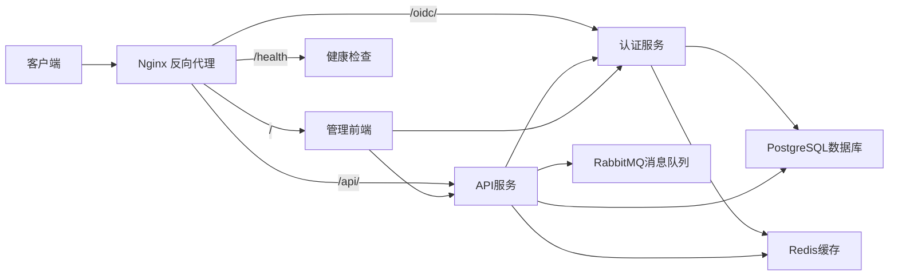

# PhoenixCoder 架构设计文档

## 1. 架构概述

PhoenixCoder是一个基于微服务架构的应用系统，采用前后端分离设计，主要由认证服务、API服务、管理前端和基础设施服务组成。系统使用Docker容器化部署，通过Nginx作为统一入口进行请求路由。

## 2. 系统组件

### 2.1 核心服务

- **oidc-server**：认证服务，基于FastAPI实现，提供OIDC认证协议支持，负责用户身份验证、授权和令牌管理
- **server**：API服务，基于FastAPI实现，提供业务功能API
- **admin**：管理前端，基于React实现，提供系统管理界面

### 2.2 基础设施服务

- **postgres**：PostgreSQL数据库，存储用户、应用和业务数据
- **redis**：Redis缓存，用于会话管理和临时数据存储
- **rabbitmq**：消息队列，用于服务间异步通信
- **nginx**：反向代理服务器，处理请求路由、负载均衡和安全策略

## 3. 技术栈

- **后端框架**：FastAPI (Python)
- **前端框架**：React
- **数据库**：PostgreSQL 14
- **缓存**：Redis 7
- **消息队列**：RabbitMQ 3
- **反向代理**：Nginx
- **容器化**：Docker
- **编排工具**：Docker Compose

## 4. 系统架构图

## 5. 数据流

### 5.1 认证流程

1. 客户端访问应用
2. Nginx将请求路由到admin前端
3. 前端重定向到oidc-server进行认证
4. 用户登录后，oidc-server生成授权码
5. 前端使用授权码换取ID令牌和访问令牌
6. 前端使用访问令牌访问API服务

### 5.2 API请求流程

1. 客户端发送API请求
2. Nginx将请求路由到server服务
3. server服务验证令牌有效性
4. server服务处理业务逻辑
5. server服务从数据库或缓存获取数据
6. server服务返回响应

## 6. 部署架构

所有服务通过Docker容器化部署，使用Docker Compose进行编排。服务之间通过phoenixcoder-network桥接网络通信。Nginx作为入口点暴露80和443端口。

## 7. 安全设计

- 使用OIDC和JWT进行身份验证和授权
- Nginx配置安全HTTP头(X-Frame-Options, X-XSS-Protection等)
- 实现HTTPS加密传输
- 敏感数据加密存储
- API访问权限控制

## 8. 性能优化

- 使用Redis缓存热点数据
- Nginx配置Gzip压缩
- 静态资源缓存策略(1年)
- 数据库索引优化
- 连接池配置

## 9. 扩展性设计

- 服务解耦，便于独立扩展
- 使用消息队列处理异步任务
- 支持水平扩展的无状态服务设计
- 配置中心设计(预留)