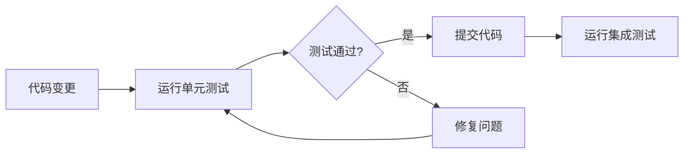

# PhoenixCoder 智能分层测试策略

## 🎯 测试架构概览

### 测试金字塔结构

```
        🔺 E2E Tests (端到端测试)
       /              \
      /   Integration   \
     /     Tests        \
    /   (集成测试)       \
   /____________________\
  /                      \
 /      Unit Tests        \
/      (单元测试)          \
\________________________/
```

### 测试分层定义

| 测试层级   | 覆盖范围     | 运行频率 | 执行时间 | 覆盖率目标 |
| ---------- | ------------ | -------- | -------- | ---------- |
| 单元测试   | 函数/组件    | 每次提交 | < 30s    | ≥ 80%     |
| 集成测试   | 模块间交互   | 每次推送 | < 5min   | ≥ 60%     |
| 端到端测试 | 完整用户流程 | 发布前   | < 15min  | ≥ 40%     |

## 🏗️ 技术栈配置

### 后端测试 (Python + pytest)

```yaml
技术栈:
  - pytest: 测试框架
  - pytest-asyncio: 异步测试支持
  - pytest-cov: 覆盖率报告
  - pytest-xdist: 并行测试
  - pytest-mock: Mock支持
  - factory-boy: 测试数据工厂
  - httpx: HTTP客户端测试
  - pytest-benchmark: 性能基准测试
```

### 前端测试 (TypeScript + Vitest)

```yaml
技术栈:
  - vitest: 测试框架
  - @testing-library/react: React组件测试
  - @testing-library/user-event: 用户交互测试
  - jsdom: DOM环境模拟
  - @vitest/coverage-v8: 覆盖率报告
  - msw: API Mock服务
  - @storybook/test: 组件故事测试
```

## 🧠 智能测试策略

### 1. 智能测试选择

```typescript
// 基于文件变更的智能测试选择
interface TestSelectionStrategy {
  // 文件变更影响分析
  analyzeChangedFiles(files: string[]): TestSuite[];
  
  // 依赖关系图分析
  analyzeDependencies(module: string): string[];
  
  // 风险评估
  assessRisk(changes: FileChange[]): RiskLevel;
}
```

### 2. 分层测试运行策略

```bash
# 快速反馈循环 (< 30秒)
pnpm run test:unit:changed

# 中等反馈循环 (< 5分钟)
pnpm run test:integration:affected

# 完整测试套件 (< 15分钟)
pnpm run test:e2e:critical
```

### 3. 并行测试执行

```yaml
并行策略:
  单元测试: 按文件并行 (8个worker)
  集成测试: 按模块并行 (4个worker)
  E2E测试: 按场景并行 (2个worker)
```

## 📊 测试覆盖率监控

### 覆盖率阈值配置

```json
{
  "coverage": {
    "statements": 80,
    "branches": 75,
    "functions": 85,
    "lines": 80
  },
  "thresholds": {
    "critical": 90,
    "high": 80,
    "medium": 60,
    "low": 40
  }
}
```

### 覆盖率报告格式

- HTML报告: 详细的可视化覆盖率
- JSON报告: CI/CD集成数据
- LCOV报告: IDE集成显示
- 控制台报告: 快速反馈

## 🔄 测试生命周期

### 开发阶段



### 发布阶段


## 🎯 测试质量指标

### 核心指标

| 指标         | 目标值  | 监控频率 |
| ------------ | ------- | -------- |
| 测试通过率   | ≥ 98%  | 实时     |
| 代码覆盖率   | ≥ 80%  | 每次构建 |
| 测试执行时间 | < 15min | 每次构建 |
| 缺陷逃逸率   | < 2%    | 每周     |
| 测试稳定性   | ≥ 95%  | 每日     |

### 质量门禁

```yaml
质量门禁:
  - 单元测试通过率: 100%
  - 代码覆盖率: ≥ 80%
  - 集成测试通过率: ≥ 95%
  - 性能回归: < 10%
  - 安全扫描: 无高危漏洞
```

## 🚀 智能特性

### 1. 自适应测试执行

- **变更影响分析**: 基于代码变更自动选择相关测试
- **风险评估**: 根据变更复杂度调整测试策略
- **智能重试**: 失败测试的智能重试机制

### 2. 测试数据管理

- **数据工厂**: 自动生成测试数据
- **数据隔离**: 测试间数据完全隔离
- **数据清理**: 自动清理测试数据

### 3. 性能监控

- **基准测试**: 自动性能基准建立
- **回归检测**: 性能回归自动告警
- **趋势分析**: 性能趋势可视化

## 📋 实施计划

### 阶段一: 基础设施 (1-2周)

- [ ] 配置pytest和vitest测试框架
- [ ] 设置测试覆盖率监控
- [ ] 创建测试数据工厂

### 阶段二: 智能化 (2-3周)

- [ ] 实现智能测试选择
- [ ] 配置并行测试执行
- [ ] 设置性能基准测试

### 阶段三: 集成优化 (1-2周)

- [ ] 配置预提交钩子
- [ ] 设置CI/CD集成
- [ ] 优化测试执行效率

## 🔧 工具链集成

### IDE集成

- **VSCode**: 测试运行器插件
- **覆盖率显示**: 实时覆盖率高亮
- **测试调试**: 断点调试支持

### CI/CD集成

- 
- **GitHub Actions**: 自动化测试流水线
- **测试报告**: PR中的测试结果展示
- **质量门禁**: 自动化质量检查

### 监控告警

- **测试失败告警**: 即时通知机制
- **覆盖率下降告警**: 覆盖率阈值监控
- **性能回归告警**: 性能指标监控

---

*本文档将随着项目发展持续更新和优化*